```mermaid
graph TD
    A[User] --> B[Login/Register]
    A --> C[View Dashboard]
    A --> D[Manage Projects]
    A --> E[Label Images]
    A --> F[Export Data]
    A --> G[Collaborate]

    B --> B1[Login]
    B --> B2[Register]
    B --> B3[Reset Password]

    C --> C1[View Statistics]
    C --> C2[View Progress]
    C --> C3[View Recent Activities]

    D --> D1[Create Project]
    D --> D2[Edit Project]
    D --> D3[Delete Project]
    D --> D4[Manage Members]

    E --> E1[Upload Images]
    E --> E2[Assign Labels]
    E --> E3[Review Labels]
    E --> E4[Validate Labels]

    F --> F1[Export to CSV]
    F --> F2[Export to JSON]
    F --> F3[Export to YOLO]

    G --> G1[Share Project]
    G --> G2[Comment]
    G --> G3[Real-time Collaboration]
```

## Use Case Diagram Description

### Actors

- **User**: Người dùng hệ thống (có thể là admin, người gán nhãn, người quản lý dự án)

### Main Use Cases

1. **Login/Register**

   - Login: Đăng nhập vào hệ thống
   - Register: Đăng ký tài khoản mới
   - Reset Password: Khôi phục mật khẩu

2. **View Dashboard**

   - View Statistics: Xem thống kê dự án
   - View Progress: Theo dõi tiến độ
   - View Recent Activities: Xem hoạt động gần đây

3. **Manage Projects**

   - Create Project: Tạo dự án mới
   - Edit Project: Chỉnh sửa thông tin dự án
   - Delete Project: Xóa dự án
   - Manage Members: Quản lý thành viên dự án

4. **Label Images**

   - Upload Images: Tải lên hình ảnh
   - Assign Labels: Gán nhãn cho hình ảnh
   - Review Labels: Xem lại nhãn đã gán
   - Validate Labels: Xác thực nhãn

5. **Export Data**

   - Export to CSV: Xuất dữ liệu dạng CSV
   - Export to JSON: Xuất dữ liệu dạng JSON
   - Export to YOLO: Xuất dữ liệu theo định dạng YOLO

6. **Collaborate**
   - Share Project: Chia sẻ dự án
   - Comment: Thêm bình luận
   - Real-time Collaboration: Cộng tác thời gian thực
